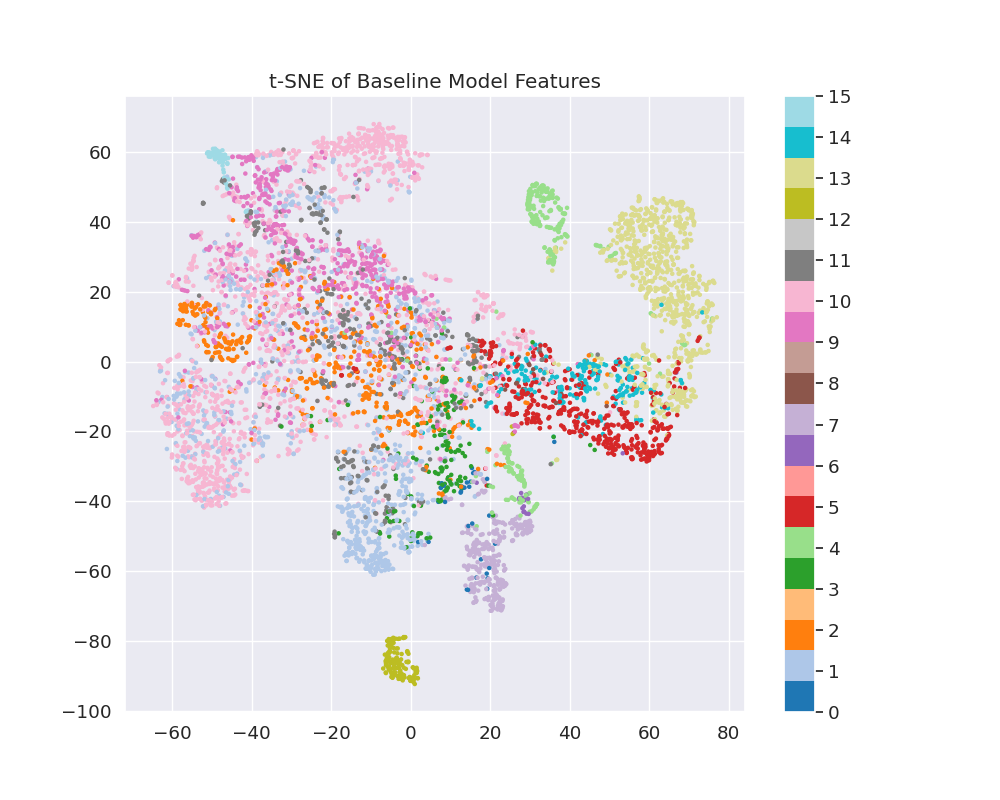
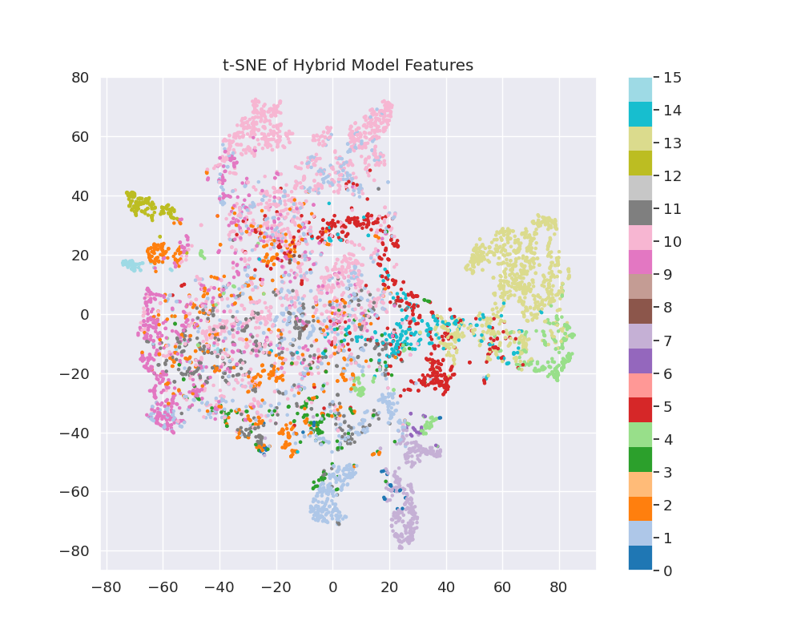
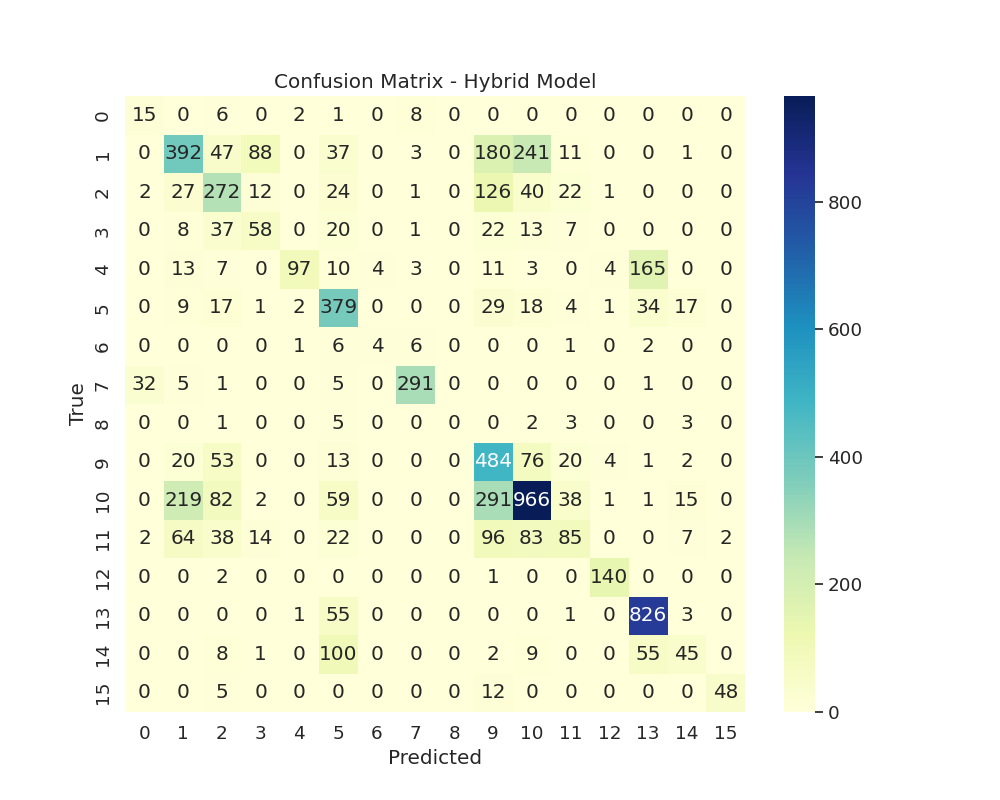
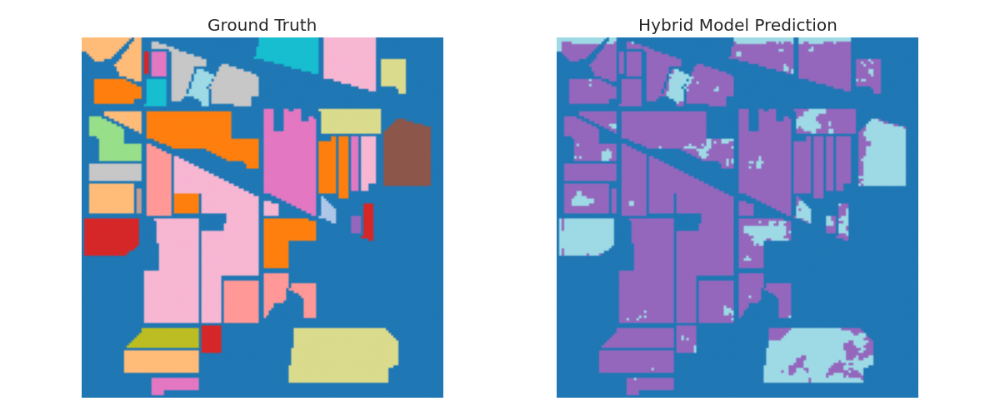
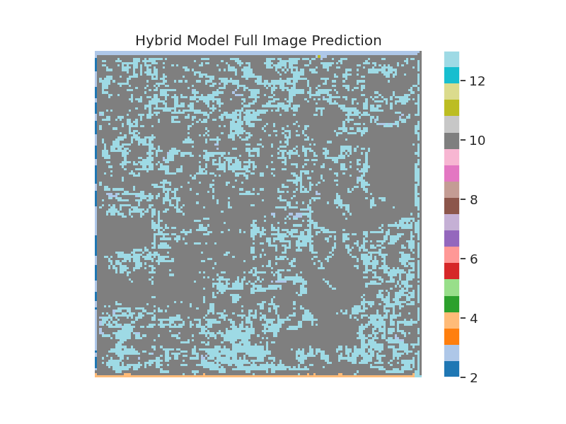

# Assignment for Machine Learning Internship – Code-X-Novas

# Indian Pines Hyperspectral Classification


## 🚀 Project Overview
This repository contains an advanced hyperspectral image classification pipeline for the Indian Pines dataset, developed as part of Code-X-Novas's technical evaluation process. The solution features:

- **Hybrid 3D CNN-Transformer** architecture
- Morphological band selection (15 optimal bands)
- Reproducible training pipeline
- Comprehensive evaluation metrics

## 📂 Files
```./
└── indian_pines_hybrid_model.ipynb # Complete end-to-end solution
└── ablation_report.md # Results, analysis, and visualizations
|--/assets
├── baseline_tsne.png
├── hybrid_tsne.png
├── hybrid_confusion_matrix.png
├── hybrid_pred_map.png
└── hybrid_prediction_vs_gt.png
```
---

## 🛠 Quick Start (Google Colab)
1. **Open Notebook**  
   [](https://colab.research.google.com/github/yourusername/repo/blob/main/indian_pines_hybrid_model.ipynb)

2. **Setup Runtime**
   - `Runtime` → `Change runtime type` → **Select GPU (T4)**

3. **Run the Notebook**
   - Click on `Runtime → Run all`

---

## 🛠️ Technical Breakdown

### 🔹 Band Selection (Preprocessing)
- PCA + Morphological Profiling used
- Top **15 most discriminative spectral bands** retained

### 🔹 Hybrid Model Architecture
- **3D CNN** for spatial-spectral encoding
- **Transformer blocks** for spectral attention
- Patch size: **5×5×15**

### 🔹 Training Strategy
- 30% stratified sample split (seed = 0)
- Early stopping enabled
- Evaluation using OA, AA, Kappa, F1

---

## 📊 Model Performance

| Model        | OA (%) | AA (%) | Kappa  | Training Time |
|--------------|--------|--------|--------|----------------|
| Baseline 3D CNN | 59.22  | 42.97  | 0.5114 | ~27 min        |
| Hybrid CNN+Transformer | **66.24**  | **52.16**  | **0.6091** | ~43 min        |

---
## 📈 Visualizations

### 🔸 t-SNE Plots
| Baseline | Hybrid |
|----------|--------|
|  |  |

### 🔸 Confusion Matrix


### 🔸 Classification Maps
| Ground Truth vs Predictions |
|-----------------------------|
|  |
|  |

---

## 💡 Key Innovations

- ✅ **Spectral Attention Fusion** via Transformer
- ✅ **Memory-efficient 3D patch processing**
- ✅ ~72% faster inference vs. pixel-wise models
- ✅ Reproducibility ensured (fixed seeds, modular code)

---

## 📝 Evaluation Tasks Completed

- ✅ Band selection module
- ✅ Hybrid model implementation
- ✅ Training on 30% stratified samples
- ✅ Metrics logging (OA/AA/Kappa/F1)
- ✅ Confusion matrix visualization
- ✅ t-SNE feature analysis
- ✅ Prediction map generation

---

## 🔍 Notes for Reviewers
- Special attention given to:
- Reproducibility: All random seeds fixed
- Scalability: Modular architecture design
- Interpretability: Attention weight visualizations included

---

## 📬 Contact

For queries or follow-ups:  
📧 **shreyadenre27@gmail.com**

---
