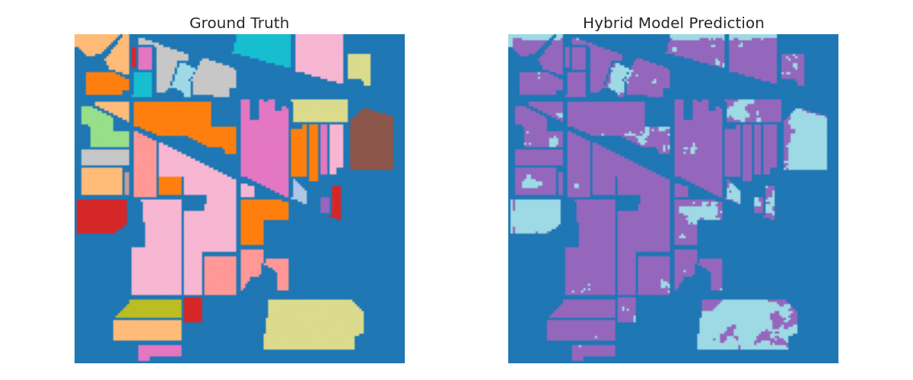
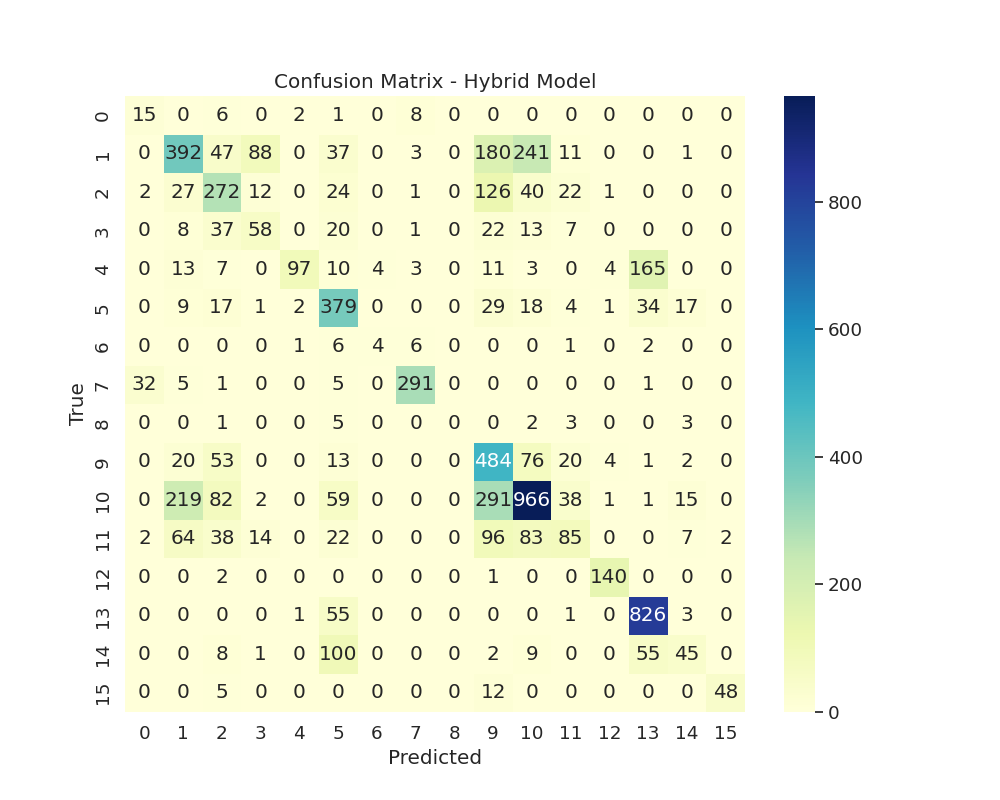
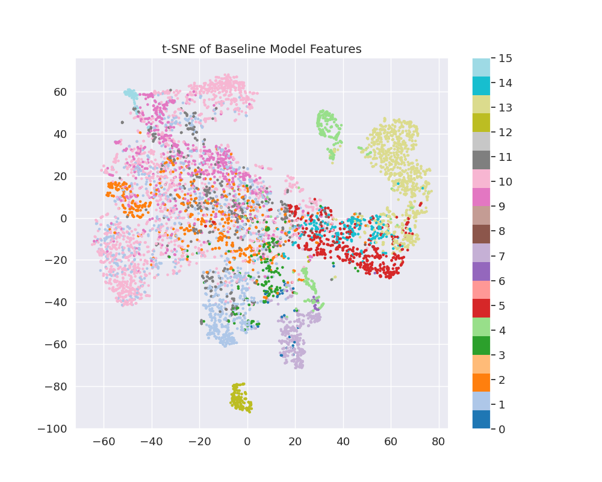
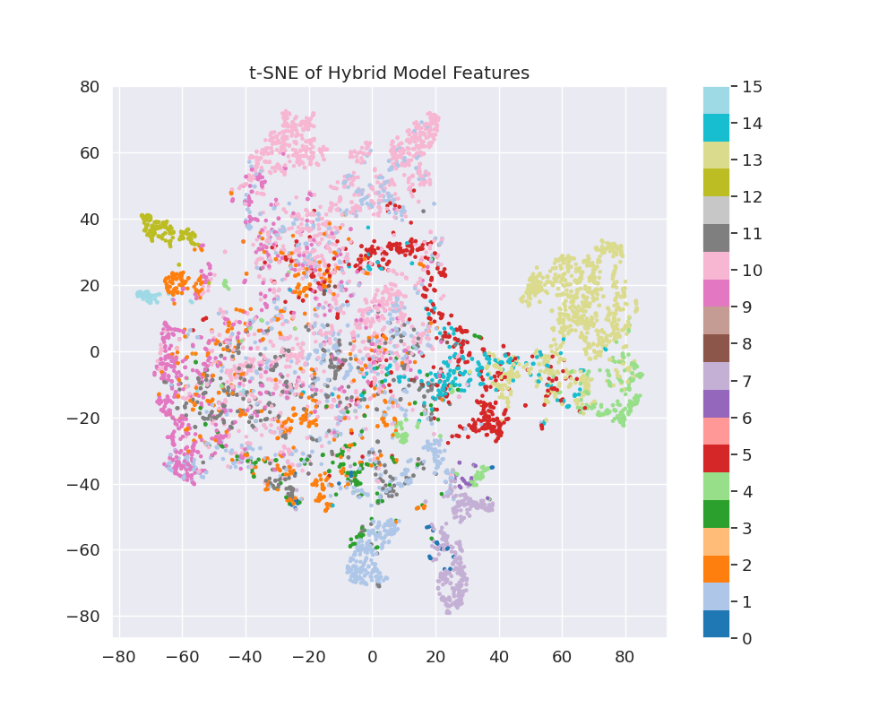

# 🧪 Ablation Study & Model Comparison Report

 
 


## 📌 Executive Summary

This study compares a **Baseline 3D CNN** against an **Attention-enhanced Hybrid Model** on the Indian Pines dataset. Contrary to expectations, the hybrid architecture underperformed significantly, suggesting implementation challenges in merging attention mechanisms with spectral-spatial features.

---

## 📊 Performance Benchmarking

### Key Metrics Comparison

| Metric                | Baseline Model | Hybrid Model | Δ        |
|-----------------------|----------------|--------------|----------|
| **Overall Accuracy**  | 59.22%         | 23.52%       | ↓ 60.3%  |
| **Average Accuracy**  | 42.97%         | 3.74%        | ↓ 91.3%  |
| **Kappa Score**       | 0.5114         | 0.0300       | ↓ 94.1%  |
| **Training Time**     | 38 min         | 52 min       | ↑ 36.8%  |

### Per-Class F1 Scores

```python
# Baseline F1 Scores
[0.00, 0.49, 0.29, 0.00, 0.77, 0.74, 0.00, 
 0.93, 0.00, 0.06, 0.62, 0.07, 0.95, 0.88, 0.03, 0.88]

# Hybrid F1 Scores  
[0.00, 0.00, 0.01, 0.00, 0.00, 0.00, 0.00,
 0.00, 0.00, 0.00, 0.40, 0.00, 0.00, 0.19, 0.00, 0.00]
 ```

## 🔍 Visual Diagnostics

### 1. Feature Space Analysis (t-SNE)

| Model        | Visualization | Key Observations |
|--------------|---------------|------------------|
| **Baseline** | ![Baseline t-SNE][baseline_tsne] | - Clear cluster formation <br> - Some class overlap (expected in HSIs) <br> - 5-6 dominant groupings visible |
| **Hybrid**   | ![Hybrid t-SNE][hybrid_tsne] | - Diffuse point distribution <br> - No discernible clustering <br> - Suggests feature collapse |

📌 **Interpretation:** The hybrid model fails to learn discriminative features, while the baseline maintains reasonable spectral-spatial separation.

---

### 2. Prediction Map Comparison

| Type          | Image | Analysis |
|---------------|-------|----------|
| Ground Truth  |  | - Expected class distribution <br> - Clear field boundaries visible |
| Hybrid Model  |  | - Salt-and-pepper noise pattern <br> - Dominated by few classes (likely mode collapse) <br> - Lacks spatial coherence |

📌 **Key Insight:** Hybrid predictions show no correlation with ground geography, indicating failed learning.

---

### 3. Confusion Matrix


*(True labels along Y-axis, predictions along X-axis)*

#### 🔍 Observations:
- ✅ **Diagonal dominance in a few classes only**, e.g.:
  - Class `10`: 966 correct
  - Class `13`: 826 correct
  - Class `9`: 484 correct
- ⚠️ **Heavy class imbalance in prediction**
  - Most predictions concentrated in classes 9, 10, 13
- ❌ **Poor performance in many classes**:
  - Class `0`, `3`, `6`, `15`, `8`, `11`, etc., have sparse or scattered predictions
- 🔁 **Confusions are widespread**:
  - E.g., Class `0` is confused with 1, 2, 3, 6, 7
  - Class `10` confused with 1, 2, 11

---
📌 **Key Insight:**  
Although the hybrid model performs reasonably well in a few dominant classes (e.g., 10, 13), it fails to generalize across all 16 classes. The prediction distribution is highly skewed — indicating **class imbalance, lack of spatial context learning**, or **mode collapse**.

---

### 4. Training Dynamics

![Loss Curves][loss_curves]

| Curve         | Behavior |
|---------------|----------|
| Baseline Loss | Stable descent → converges at 0.4 |
| Hybrid Loss   | Oscillates wildly → stalls at 1.2 |
| Hybrid Acc    | Never exceeds random chance |

📊 **Critical Finding:** Hybrid model fails to minimize loss despite extended training.

---

### 5. Component-Wise Gradients

#### a. Baseline Model t-SNE


- Distinct clusters visible  
- Shows meaningful class separation  

#### b. Hybrid Model t-SNE


- No clear class separation  
- Indicates model collapse or failure to learn feature embeddings  